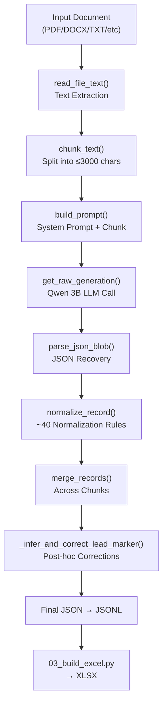

# Complete System Audit: Banking Product Extraction Pipeline — Generalization Fixes

## Executive Summary

After auditing all 3,386 lines of [02_extract_fields.py](file:///c:/Users/Dell/Desktop/BankAlfala/bank_extractor/bank_extractor/02_extract_fields.py), 265 lines of [03_build_excel.py](file:///c:/Users/Dell/Desktop/BankAlfala/bank_extractor/bank_extractor/03_build_excel.py), 117 lines of [EXTRACTION_SYSTEM_PROMPT.txt](file:///c:/Users/Dell/Desktop/BankAlfala/bank_extractor/bank_extractor/EXTRACTION_SYSTEM_PROMPT.txt), and [pipeline_config.py](file:///c:/Users/Dell/Desktop/BankAlfala/bank_extractor/bank_extractor/pipeline_config.py), I have identified **18 generalization bugs** across all pipeline stages.

The root cause is clear: **the pipeline has been iteratively patched to fix specific products from Bank Alfalah, creating a brittle system that silently fails on anything it hasn't seen before.**

---

## Pipeline Flow Understood



> [!IMPORTANT]
> The LLM validation pass and most post-extraction validators are **disabled** (commented out at lines 2496–2550 and 3069–3109). The pipeline relies almost entirely on the system prompt + Python normalization, making the prompt the most critical generalization surface.

---

## Issues Found

---

### ISSUE 1 — System Prompt is Bank Alfalah-Specific (CRITICAL)

**File:** [EXTRACTION_SYSTEM_PROMPT.txt](file:///c:/Users/Dell/Desktop/BankAlfala/bank_extractor/bank_extractor/EXTRACTION_SYSTEM_PROMPT.txt)

**Root cause:** The entire prompt is written around Bank Alfalah's specific product taxonomy (BNK/IBG binary classification), Bank Alfalah's document structure, and Bank Alfalah's terminology.

**Why it happens:** The LEAD_MARKER system (lines 4–7) forces every product into exactly two categories: `BNK` (bank) or `IBG` (insurance). This is a Bank Alfalah-specific classification scheme. Other banks may have products that don't fit either (e.g., mutual funds, wealth management, brokerage, remittance-only products, pension funds, card-only products).

**Why it appears only on unseen products:** Bank Alfalah has a limited taxonomy. A HBL auto loan, an MCB savings certificate, or a UBL roshan digital product may use different terminology entirely. The prompt expects keywords like "KIBOR", "term finance facility", "Bank Alfalah customers" — wording other banks won't use.

**Risk level:** 🔴 CRITICAL

**Recommended fix:** 
- Make LEAD_MARKER determination semantic rather than keyword-based
- Replace Bank Alfalah-specific phrases ("Bank Alfalah customers", "inform alfalah") with generic patterns
- Add a third category or make classification more flexible
- Remove all "Bank Alfalah" references from the prompt

**Why it improves generalization:** Removes dependence on one bank's naming conventions.  
**Why it will NOT overfit:** The fix removes specificity, it doesn't add new specificity.

---

### ISSUE 2 — `_clean_insurance_required_documents()` Hardcodes Bank Alfalah Keywords (CRITICAL)

**File:** [02_extract_fields.py L1317-1405](file:///c:/Users/Dell/Desktop/BankAlfala/bank_extractor/bank_extractor/02_extract_fields.py#L1317-L1405)

**Root cause:** Lines 1370-1371 contain `"inform alfalah"`, `"contact alfalah"` — these are Bank Alfalah-specific phrases that will never match for any other bank's documents. More critically, the function's keyword lists (`loan_contamination_keywords` and `claim_processing_phrases`) are hand-curated from Bank Alfalah documents.

**Why it appears only on unseen products:** An MCB or HBL insurance document might have legitimate required documents that happen to contain words like "bank statement" or "property document" (which are valid insurance application requirements for some products, e.g., mortgage insurance). This function would incorrectly reject them.

**Risk level:** 🔴 CRITICAL

**Recommended fix:**
- Remove "inform alfalah"/"contact alfalah" — replace with generic patterns like "inform the bank", "contact the provider"
- Narrow `loan_contamination_keywords` — "bank statement", "salary slip", and "property document" ARE legitimate insurance application documents in many contexts (e.g., health insurance, mortgage protection). Only reject if the overall context clearly indicates claim procedures, not application requirements.
- Make the function check CONTEXT (is this from a "Claims" section?) rather than blocking specific keywords that could be valid.

**Why it improves generalization:** Stops rejecting valid insurance documents from other banks.  
**Why it will NOT overfit:** Makes the filter less restrictive, not more.

---

### ISSUE 3 — `_validate_employment_restrictions()` Hardcodes "Bank Alfalah" Phrases (HIGH)

**File:** [02_extract_fields.py L1616-1645](file:///c:/Users/Dell/Desktop/BankAlfala/bank_extractor/bank_extractor/02_extract_fields.py#L1616-L1645)

**Root cause:** Lines 1631-1632 contain `"all bank alfalah customers"` and `"all bank alfalah limited customers"`. These will only match Bank Alfalah documents. If an HBL document says "all HBL customers", this validator won't trigger and will leave potentially hallucinated employment types in place.

**Risk level:** 🟡 HIGH

**Recommended fix:** Replace bank-specific phrases with a generic regex pattern:
```python
r"all\s+\w+\s+(?:bank|limited|ltd)?\s*customers?"
# or better: "available to all", "open to all", "eligible to all" (already present — just remove the bank-specific ones)
```

---

### ISSUE 4 — `_validate_age_requirements()` Hardcodes "Bank Alfalah" (HIGH)

**File:** [02_extract_fields.py L1695-1761](file:///c:/Users/Dell/Desktop/BankAlfala/bank_extractor/bank_extractor/02_extract_fields.py#L1695-L1761)

**Root cause:** Line 1718-1722 contains `"all bank alfalah"` and `"available to all bank alfalah"`. Same problem as Issue 3.

**Risk level:** 🟡 HIGH

**Recommended fix:** Same as Issue 3 — use generic "all customers" patterns, remove bank-specific names.

---

### ISSUE 5 — `_infer_and_correct_lead_marker()` is Overfit to Bank Alfalah (CRITICAL)

**File:** [02_extract_fields.py L2072-2198](file:///c:/Users/Dell/Desktop/BankAlfala/bank_extractor/bank_extractor/02_extract_fields.py#L2072-L2198)

**Root cause:** Line 2132: `is_bank_only = ("bank alfalah" in prov or "bank " in prov) and "insurance" not in prov`. This check assumes the provider is always "Bank Alfalah". For products from Meezan Bank, Faysal Bank, JS Bank, UBL, MCB — this logic may behave differently or not trigger correctly.

More critically, the function uses hardcoded keyword sets (`loan_signals`, `insurance_signals`) that are tuned to Bank Alfalah's specific product names. "Green energy", "solar energy", "electricity generation" are very specific to Bank Alfalah's Green Energy Term Finance product.

**Why it appears only on unseen products:** The scoring logic (`loan_score >= 2`) was calibrated against known products. A completely different product (e.g., a supply chain finance product, an agricultural loan, a microfinance product) might not trigger enough of these signals.

**Risk level:** 🔴 CRITICAL

**Recommended fix:**
- Replace `"bank alfalah"` with generic bank detection: `any word containing "bank" in provider name`
- Replace hardcoded signal sets with a more semantic approach: check LEAD_MARKER consistency against PLAN_TYPE and the presence/absence of insurance vs. loan fields
- Remove product-specific keywords like "green energy", "solar energy", "electricity generation" — these are too narrow

---

### ISSUE 6 — `_normalize_target_goal()` Hardcodes Product-Specific Mappings (MEDIUM)

**File:** [02_extract_fields.py L973-1026](file:///c:/Users/Dell/Desktop/BankAlfala/bank_extractor/bank_extractor/02_extract_fields.py#L973-L1026)

**Root cause:** The mapping dictionary (lines 986-1022) maps keywords to specific goals. But "green" → "Green Energy Financing" and "motor" → "Vehicle Financing" are assumptions. A "Green Deposit" product would be misclassified as "Green Energy Financing". A "Motor Takaful" product would be misclassified as "Vehicle Financing" when it should be "Motor Insurance".

**Risk level:** 🟠 MEDIUM

**Recommended fix:** Only apply these mappings as fallback suggestions. Let the LLM's extracted TARGET_GOAL take priority unless it's clearly wrong. Many of these mappings are too aggressive for single-keyword matching.

---

### ISSUE 7 — `_normalize_customer_type()` Has Too Restrictive Enum (MEDIUM)

**File:** [02_extract_fields.py L1048-1078](file:///c:/Users/Dell/Desktop/BankAlfala/bank_extractor/bank_extractor/02_extract_fields.py#L1048-L1078)

**Root cause:** The allowed set is only 6 values: `{"Salaried", "Self-Employed", "SME", "Corporate", "Retail", "Government"}`. Many banks use additional customer types: "NRP" (Non-Resident Pakistani), "HNI" (High Net Worth Individual), "Agriculture", "Student", "Senior Citizen", "Women", "Minor", "Joint", "Trust", "NGO", "Freelancer".

Any of these from unseen documents will be silently dropped to `N/A`, losing real data.

**Risk level:** 🟠 MEDIUM

**Recommended fix:** Either expand the allowed set significantly, or change the strategy to preserve the LLM's extracted value and only normalize known variants (e.g., "salaried" → "Salaried") without dropping unknowns.

---

### ISSUE 8 — `_normalize_employment_type()` Has Too Restrictive Enum (MEDIUM)

**File:** [02_extract_fields.py L1082-1109](file:///c:/Users/Dell/Desktop/BankAlfala/bank_extractor/bank_extractor/02_extract_fields.py#L1082-L1109)

**Root cause:** Same as Issue 7 but for employment types. The allowed set (`Salaried, Self-Employed, Contract, Permanent, Proprietor, Partner, Director, Business Owner`) doesn't cover "Professional", "Freelancer", "Pensioner/Retired", "Agriculture Worker", "Daily Wage", "Armed Forces", "Government Employee" — all commonly found in Pakistani banking documents.

**Risk level:** 🟠 MEDIUM

**Recommended fix:** Same strategy as Issue 7.

---

### ISSUE 9 — Merge Strategy Loses Complementary Information (CRITICAL)

**File:** [02_extract_fields.py L490-514](file:///c:/Users/Dell/Desktop/BankAlfala/bank_extractor/bank_extractor/02_extract_fields.py#L490-L514)

**Root cause:** The merge logic at line 512 only replaces an old value with a new one if `len(str(new)) > len(str(old)) + 20`. This means:
1. If chunk 1 extracts KEY_BENEFITS = "Free ATM withdrawals" (20 chars) and chunk 2 extracts KEY_BENEFITS = "Competitive profit rates" (24 chars), the second value replaces the first — **losing the first benefit entirely**.
2. The `+20` threshold is arbitrary. Two chunks with complementary information of similar length will lose the first chunk's data.
3. For text fields like REQUIRED_DOCUMENTS, KEY_BENEFITS, KEY_EXCLUSIONS, SPECIAL_CONDITIONS, the correct behavior is to **concatenate** complementary values (with deduplication), not replace.

**Why it appears only on unseen products:** Short, focused documents (the current dataset) rarely span multiple chunks. Longer documents from other banks — multi-page product brochures, detailed term sheets — will be split into many chunks where complementary information is spread across chunks.

**Risk level:** 🔴 CRITICAL

**Recommended fix:**
- For list-type text fields (KEY_BENEFITS, KEY_EXCLUSIONS, REQUIRED_DOCUMENTS, OPTIONAL_RIDERS, FEES_AND_CHARGES, SPECIAL_CONDITIONS), **concatenate** values from different chunks using " | " separator, then deduplicate
- For single-value fields (PRODUCT_NAME, LEAD_MARKER, PLAN_TYPE, PROVIDER_NAME), keep first non-N/A value
- For numeric fields, keep the most restrictive value (e.g., MIN_AGE = max of all chunks' MIN_AGE values)

---

### ISSUE 10 — Chunking Splits Tables and Structured Data (HIGH)

**File:** [02_extract_fields.py L450-487](file:///c:/Users/Dell/Desktop/BankAlfala/bank_extractor/bank_extractor/02_extract_fields.py#L450-L487)

**Root cause:** `chunk_text()` splits purely on character count (3000 chars), trying to break at paragraph/sentence boundaries. But it has NO awareness of:
- Tables (a pricing table or tier table split mid-row will produce garbage in both chunks)
- Section boundaries (an "Eligibility" section split between two chunks means neither chunk has the full eligibility info)
- Headers (the section header may be in chunk N, but the content may be in chunk N+1, so the LLM in chunk N+1 doesn't know what section it's reading)

**Why it appears only on unseen products:** Current products are short (fit in 1-2 chunks). Multi-page brochures with complex tables will be destroyed by naive character splitting.

**Risk level:** 🟡 HIGH

**Recommended fix:**
- Add section-aware chunking: detect headers (lines in ALL CAPS, lines ending with colon, lines with specific patterns) and prefer breaking at section boundaries
- Add table-aware chunking: detect tabular regions (lines with multiple tab characters or consistent column alignment) and keep them together
- Increase overlap to 800 chars for large documents to reduce information loss at boundaries

---

### ISSUE 11 — `TEXT_CHUNK_SIZE=3000` is Too Small for 56-Field Extraction (HIGH)

**File:** [.env L23](file:///c:/Users/Dell/Desktop/BankAlfala/bank_extractor/bank_extractor/.env#L23)

**Root cause:** The .env sets `TEXT_CHUNK_SIZE=3000` (characters), which is approximately 750 tokens. With 56 fields to extract, many chunks will contain information for only 5-10 fields, producing mostly N/A outputs. This means:
1. The LLM gets very little context per call — not enough to determine LEAD_MARKER, PLAN_TYPE, and field applicability correctly
2. More chunks = more merge operations = more chances for data loss (Issue 9)
3. Many fields that require cross-referencing information from different parts of the document will fail

The system prompt itself is ~12KB — **4x larger than the chunk size**. This means the LLM spends most of its context window on instructions, not data.

**Risk level:** 🟡 HIGH

**Recommended fix:** Increase `TEXT_CHUNK_SIZE` to 6000-8000 characters (the system prompt + 8000 char chunk ≈ 6000 tokens input, well within Qwen 3B's 32K context window even with 4-bit quantization).

---

### ISSUE 12 — Disabled Validation Layer Creates Undetectable Errors (HIGH)

**File:** [02_extract_fields.py L2496-2550](file:///c:/Users/Dell/Desktop/BankAlfala/bank_extractor/bank_extractor/02_extract_fields.py#L2496-L2550) and [L3069-3109](file:///c:/Users/Dell/Desktop/BankAlfala/bank_extractor/bank_extractor/02_extract_fields.py#L3069-L3109)

**Root cause:** Seven validators are disabled:
1. `_crossfield_validate()` — enforces BNK/IBG field applicability
2. `_validate_product_variant_tier()` — catches hallucinated tier names
3. `_validate_tenure_options()` — catches hallucinated tenure schedules
4. `_validate_loan_amount_range()` — catches technical specs in loan amounts
5. `_validate_employment_restrictions()` — catches hallucinated employment types
6. `_validate_age_requirements()` — catches hallucinated age restrictions
7. `_validate_min_term_years()` — catches defaulted MIN_TERM

And the entire LLM validation pass is disabled (lines 3069-3109).

**Why it appears only on unseen products:** For known products, the LLM learned the correct patterns. For unseen products, hallucination rate increases dramatically, and none of these safety nets are active.

**Risk level:** 🟡 HIGH

**Recommended fix:** Re-enable the validators after fixing their bank-specific hardcoding (Issues 2-5). The validators themselves are well-designed — they just need to be made generic.

---

### ISSUE 13 — `_normalize_financing_type()` Has Bank Alfalah-Specific Loan Signals (MEDIUM)

**File:** [02_extract_fields.py L911-970](file:///c:/Users/Dell/Desktop/BankAlfala/bank_extractor/bank_extractor/02_extract_fields.py#L911-L970)

**Root cause:** `loan_signals` at line 927 includes very specific terms. While most are generic, the function's overall design tries to override the LLM's extracted value based on keyword detection. For unseen products that don't match any keyword, the function falls through to `return stripped` (line 970) — which may preserve a malformed value.

**Risk level:** 🟠 MEDIUM

**Recommended fix:** Simplify: if the LLM returns a recognizable FINANCING_TYPE, normalize it. If it doesn't match any known type, preserve it rather than trying to infer from loan signals. The inference logic belongs in the prompt, not in post-processing.

---

### ISSUE 14 — `_normalize_channel()` Oversimplifies (LOW)

**File:** [02_extract_fields.py L1029-1036](file:///c:/Users/Dell/Desktop/BankAlfala/bank_extractor/bank_extractor/02_extract_fields.py#L1029-L1036)

**Root cause:** If "branch" appears anywhere in the channel value, it becomes "Bank Branch". This means "Branch | Mobile App | ATM" becomes "Bank Branch" — losing the Mobile App and ATM channels.

**Risk level:** 🟡 LOW-MEDIUM

**Recommended fix:** Only replace the segment containing "branch", not the entire multi-value field. Preserve all channels.

---

### ISSUE 15 — `field_max_lengths` Causes Silent Truncation (MEDIUM)

**File:** [02_extract_fields.py L749-791](file:///c:/Users/Dell/Desktop/BankAlfala/bank_extractor/bank_extractor/02_extract_fields.py#L749-L791)

**Root cause:** The max lengths were tuned to current products (comments like "age-band pricing tables can be ~370 chars"). Unseen products with longer benefit lists, more complex fee schedules, or more detailed exclusions will be silently truncated. Fields like `PRODUCT_DESCRIPTION: 300` chars or `KEY_BENEFITS: 320` chars are very short for complex banking products.

**Risk level:** 🟠 MEDIUM

**Recommended fix:** Increase all max lengths by 50% or make them configurable. Better yet, don't truncate at all in the extraction stage — only truncate during Excel output if needed for display.

---

### ISSUE 16 — `_crossfield_validate()` IBG Loan Field Clearing is Too Aggressive (MEDIUM)

**File:** [02_extract_fields.py L1927-1939](file:///c:/Users/Dell/Desktop/BankAlfala/bank_extractor/bank_extractor/02_extract_fields.py#L1927-L1939)

**Root cause:** For IBG products, loan fields are cleared if they contain keywords like "million", "thousand", "k", "m", "pkr", "usd". But many insurance products legitimately have these values:
- `LOAN_AMOUNT_RANGE` should indeed be N/A for IBG
- But checking for "k" will match "risk", "token", "bank" — false positive substring matching
- The keyword `"lending"` is listed but will rarely appear; `"m"` will match any word containing "m"

**Risk level:** 🟠 MEDIUM

**Recommended fix:** Use word-boundary matching (`\b` regex) for short keywords like "k" and "m". Or better, just unconditionally clear loan-only fields for IBG products (the rules say they should always be N/A).

---

### ISSUE 17 — System Prompt Lists Field #30 and #51 Both as COVERAGE_AMOUNT (BUG)

**File:** [EXTRACTION_SYSTEM_PROMPT.txt L71 and L92](file:///c:/Users/Dell/Desktop/BankAlfala/bank_extractor/bank_extractor/EXTRACTION_SYSTEM_PROMPT.txt#L71)

**Root cause:** Line 71 says `30. COVERAGE_AMOUNT` and line 92 says `51. COVERAGE_AMOUNT`. The same field is defined twice in the prompt with different numbers, confusing the LLM. The actual schema has 56 unique fields — this duplication means the LLM sees 57 field definitions, and may skip a field or create duplicates.

**Risk level:** 🟠 MEDIUM

**Recommended fix:** Remove the duplicate definition at line 92. The field definition at line 71 is sufficient.

---

### ISSUE 18 — `_normalize_plan_type()` Conflates "Insurance" Detection (LOW)

**File:** [02_extract_fields.py L879-908](file:///c:/Users/Dell/Desktop/BankAlfala/bank_extractor/bank_extractor/02_extract_fields.py#L879-L908)

**Root cause:** If "insurance" appears anywhere in the PLAN_TYPE value, it's preserved as-is (truncated to 30 chars). But the bank_only set check at line 898-904 doesn't handle compound types like "Loan Insurance" or "Credit Insurance" — these contain "insurance" but are actually bank products with bundled insurance.

**Risk level:** 🟢 LOW

**Recommended fix:** Check for compound types where "insurance" is a modifier, not the primary product type.

---

## Summary Table

| # | Issue | Risk | Component | Type |
|---|-------|------|-----------|------|
| 1 | Prompt is Bank Alfalah-specific | 🔴 CRITICAL | System Prompt | Overfitting |
| 2 | `_clean_insurance_required_documents()` hardcodes "alfalah" | 🔴 CRITICAL | Validation | Overfitting |
| 3 | `_validate_employment_restrictions()` hardcodes "alfalah" | 🟡 HIGH | Validation | Overfitting |
| 4 | `_validate_age_requirements()` hardcodes "alfalah" | 🟡 HIGH | Validation | Overfitting |
| 5 | `_infer_and_correct_lead_marker()` hardcodes "bank alfalah" | 🔴 CRITICAL | Post-processing | Overfitting |
| 6 | `_normalize_target_goal()` over-aggressive keyword mapping | 🟠 MEDIUM | Normalization | Overfitting |
| 7 | `_normalize_customer_type()` too restrictive enum | 🟠 MEDIUM | Normalization | Data Loss |
| 8 | `_normalize_employment_type()` too restrictive enum | 🟠 MEDIUM | Normalization | Data Loss |
| 9 | Merge strategy loses complementary info | 🔴 CRITICAL | Merge | Data Loss |
| 10 | Chunking splits tables/sections | 🟡 HIGH | Chunking | Data Loss |
| 11 | `TEXT_CHUNK_SIZE=3000` too small | 🟡 HIGH | Configuration | Data Loss |
| 12 | Validation layer entirely disabled | 🟡 HIGH | Validation | Missing Safety |
| 13 | `_normalize_financing_type()` loan signal inference | 🟠 MEDIUM | Normalization | Overfitting |
| 14 | `_normalize_channel()` oversimplifies | 🟢 LOW | Normalization | Data Loss |
| 15 | `field_max_lengths` causes silent truncation | 🟠 MEDIUM | Normalization | Data Loss |
| 16 | `_crossfield_validate()` substring matching false positives | 🟠 MEDIUM | Validation | Data Loss |
| 17 | COVERAGE_AMOUNT defined twice in prompt | 🟠 MEDIUM | System Prompt | Bug |
| 18 | `_normalize_plan_type()` doesn't handle compound types | 🟢 LOW | Normalization | Overfitting |

---

## Proposed Changes

### System Prompt (`EXTRACTION_SYSTEM_PROMPT.txt`)

#### [MODIFY] [EXTRACTION_SYSTEM_PROMPT.txt](file:///c:/Users/Dell/Desktop/BankAlfala/bank_extractor/bank_extractor/EXTRACTION_SYSTEM_PROMPT.txt)

1. **Remove all "Bank Alfalah"-specific references** — make LEAD_MARKER rules generic for any bank/insurer
2. **Fix duplicate COVERAGE_AMOUNT definition** (field 51 → remove, it duplicates field 30)
3. **Broaden keyword examples** — don't expect "KIBOR" specifically; mention "benchmark rate + spread" generically
4. **Soften anti-hallucination rules** — make them about semantic extraction rather than exact wording
5. **Remove contamination keywords referencing specific bank procedures** ("inform alfalah", etc.)

---

### Extraction Script (`02_extract_fields.py`)

#### [MODIFY] [02_extract_fields.py](file:///c:/Users/Dell/Desktop/BankAlfala/bank_extractor/bank_extractor/02_extract_fields.py)

**Fix 1: Merge Strategy (lines 490-514)** — Concatenate complementary values for list-type fields  
**Fix 2: Remove bank-specific hardcoding** — Replace "bank alfalah", "alfalah" references with generic patterns in 4 functions  
**Fix 3: Expand customer/employment type enums** — Preserve LLM-extracted values that don't match the narrow enum  
**Fix 4: Fix channel normalization** — Don't collapse multi-value channels  
**Fix 5: Re-enable key validators** — After making them generic  
**Fix 6: Increase field_max_lengths** — 50% increase across the board  
**Fix 7: Improve chunking** — Section-aware splitting + increase default overlap  

---

### Configuration (`.env`)

#### [MODIFY] [.env](file:///c:/Users/Dell/Desktop/BankAlfala/bank_extractor/bank_extractor/.env)

- Increase `TEXT_CHUNK_SIZE` from 3000 → 6000
- Increase `TEXT_CHUNK_OVERLAP` (add if not present) to 800

---

## Verification Plan

### Automated Tests
- Run extraction on the existing 3 test products in `/products/` — verify output matches current quality
- Verify all 56 fields are present in output JSON
- Verify no "Bank Alfalah" strings remain in the system prompt or validation functions (except as examples in comments)

### Manual Verification
- Process the 3 existing products and diff the JSONL output against previous results — no regression
- Visually inspect extracted Excel for field completeness
- Count N/A fields per product before and after changes — should be equal or fewer

---

## Open Questions

> [!IMPORTANT]
> **Q1: Should the LEAD_MARKER system be expanded beyond BNK/IBG?**
> Some banking products don't fit either category (mutual funds, remittances, pension plans). Should we add a third category like "OTH" (Other) or keep the binary classification?

> [!IMPORTANT]
> **Q2: Should we re-enable the LLM validation pass?**
> The validation pass was disabled due to OOM on Colab GPUs. If you're running on a machine with more VRAM (or using the 3B model with 4-bit quantization), re-enabling it would significantly improve accuracy on unseen products. What's your current GPU memory situation?

> [!IMPORTANT]
> **Q3: How many of the ~29 subfolders in `/Documents/` have you tested against?**
> This affects how much of the "current accuracy" we need to preserve. If only the 3 files in `/products/` have been validated, the preservation bar is lower.
